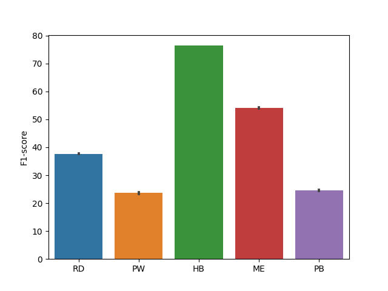

# Baseline for DCASE 2024 Task 5

The automatic detection and analysis of bioacoustic sound events is a valuable tool for assessing animal populations and their behaviours, facilitating conservation efforts, and providing insights into ecological dynamics. By leveraging advanced machine learning and computational bioacoustics techniques, it is possible to decode the complex acoustic signals of diverse species.

**Few-shot learning is a highly promising paradigm for sound event detection.** It describes tasks in which an algorithm must make predictions given only a few instances of each class, contrary to standard supervised learning paradigm. The main objective is to find reliable algorithms that are capable of dealing with data sparsity, class imbalance and noisy/busy environments.

**It is also an extremely good fit to the needs of users in bioacoustics, in which increasingly large acoustic datasets commonly need to be labelled for events of an identified category** (e.g. species or call-type), even though this category might not be known in other datasets or have any yet-known label. While satisfying user needs, this will also benchmark few-shot learning for the wider domain of sound event detection (SED).

## Description

This repo is built upon the [DCASE 2022 submission from Surrey](https://github.com/haoheliu/DCASE_2022_Task_5) for the [DCASE 2024 Challenge task 5 few-shot bio-acoustic detection](https://dcase.community/challenge2023/task-few-shot-bioacoustic-event-detection).


|    Method    | Precision (%) | Recall (%) | F-measure (%) |
| :----------: | :-----------: | :--------: | :-----------: |
| **Proposed** |     56.18     |   48.64   |     52.14     |

The species-wise perfomrnace of this system:



## How to train from scratch

1. Prepare environment

```bash
# clone project
git clone https://github.com/c4dm/dcase-few-shot-bioacoustic.git
cd baselines/dcase2024_task5

# create virtual environment
# we use python == 3.7
python -m venv ./dcase_t5
source ./dcase_t5/bin/activate
pip3 install -r requirements.txt --extra-index-url https://download.pytorch.org/whl/cu113
```

2. Prepare training and validation data. Dataset will be automatically downloaded.

```bash
python3 data_preparation.py --data-dir /dir/to/local/dataset
```

3. Change the root directory in [train.yaml](config/train.yaml).

```yaml
path:
  root_dir: <your-root-directory>
```

4. Train model with default configuration. Find more details in [train.yaml](config/train.yaml).
5. Make your own training recipe. Ones can refer to [train.yaml](config/train.yaml) for more training options and [run.sh](run.sh) for more examples.

```bash
# use PCEN as audio features and disable negative hard sampling
python3 train.py features.feature_types="pcen" train_param.negative_train_contrast=false
```

6. Train model with CPU only.

```bash
# train on CPU
python train.py trainer.gpus=0
```

## Cite this work

```bibtex
@misc{liang2024mind,
      title={Mind the Domain Gap: a Systematic Analysis on Bioacoustic Sound Event Detection}, 
      author={Jinhua Liang and Ines Nolasco and Burooj Ghani and Huy Phan and Emmanouil Benetos and Dan Stowell},
      year={2024},
      eprint={2403.18638},
      archivePrefix={arXiv},
      primaryClass={eess.AS}
}

@techreport{Liu2022a,
    Author = "Liu, Haohe and Liu, Xubo and Mei, Xinhao and Kong, Qiuqiang and Wang, Wenwu and Plumbley, Mark D",
    title = "SURREY SYSTEM FOR DCASE 2022 TASK 5 : FEW-SHOT BIOACOUSTIC EVENT DETECTION WITH SEGMENT-LEVEL METRIC LEARNING",
    institution = "DCASE2022 Challenge Technical Report",
    year = "2022"
}
```

## Acknowledgement

> This repository is implemented based on @haoheliu's amazing [repository](https://github.com/haoheliu/DCASE_2022_Task_5). Thank @haoheliu for his contribution to the community.
